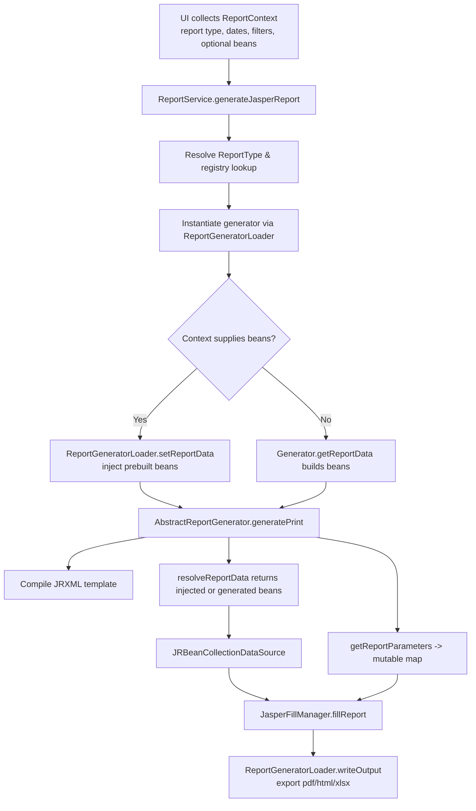

# Jasper Report Request-to-Creation Control Flow

This document illustrates how a Jasper report request moves through the Nonprofit Accounting application, from the initial request to report creation and export. It highlights where data is generated and how beans are supplied to the Jasper engine.

## Steps in the flow

1. **Collect request details**: UI layers (e.g., Swing/JavaFX panels) build a `ReportContext` with report type, date range, filters, and optionally pre-built data beans via `setBeans(...)`.
2. **Dispatch via `ReportService.generateJasperReport`**: The service validates the report type, finds the registered generator class, instantiates it, injects any pre-built beans, and invokes Jasper generation.
3. **Generate the JasperPrint**: Generators extend `AbstractReportGenerator`, which compiles the JRXML template, resolves the data list, wraps it in `JRBeanCollectionDataSource`, and fills the report with parameters.
4. **Data generation paths**:
   - **Injected beans**: If `ReportContext` contained beans, `setReportData` feeds them directly into the generator, so `resolveReportData` returns them without recalculation.
   - **Generator-built beans**: When no beans are provided, each generator’s `getReportData` builds the dataset (e.g., `AccountSummaryJasperGenerator` iterates accounts, computes balances, and emits `AccountSummaryRowBean` instances).
5. **Export the file**: After filling, the generator’s `writeJasperOutput` is called to export the `JasperPrint` to the requested format (PDF by default), returning the output file path.

## Key touchpoints

- **Request orchestration**: `ReportService.generateJasperReport` resolves the generator, injects beans from the `ReportContext` (if any), delegates `generatePrint`, and writes the output.【F:src/main/java/nonprofitbookkeeping/service/ReportService.java†L387-L434】
- **Generator lifecycle & bean handling**: `AbstractReportGenerator.generatePrint` compiles the JRXML, calls `resolveReportData`, and fills the report using a `JRBeanCollectionDataSource` plus parameters. `resolveReportData` prioritizes injected beans set via `setReportData`; otherwise, it calls `getReportData` for on-demand generation.【F:src/main/java/nonprofitbookkeeping/reports/jasper/AbstractReportGenerator.java†L53-L154】【F:src/main/java/nonprofitbookkeeping/reports/jasper/AbstractReportGenerator.java†L378-L410】
- **Example of generator-built beans**: `AccountSummaryJasperGenerator#getReportData` pulls the current company’s chart of accounts, calculates balances, and produces `AccountSummaryRowBean` rows that Jasper uses to populate the report body.【F:src/main/java/nonprofitbookkeeping/reports/jasper/AccountSummaryJasperGenerator.java†L21-L71】
- **Reflection utilities**: `ReportGeneratorLoader` handles generator instantiation, optional bean injection (`setReportData`), `generatePrint` invocation, and exporting through `writeJasperOutput` to produce the final file.【F:src/main/java/nonprofitbookkeeping/service/ReportGeneratorLoader.java†L19-L96】【F:src/main/java/nonprofitbookkeeping/service/ReportGeneratorLoader.java†L116-L187】
